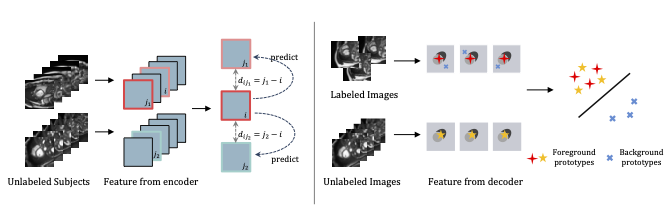

# Bootstrap Representation Learning for Segmentation on Medical Volumes and Sequences


Official PyTorch implementation of our method.
The full paper is available at: []().

## Abstract
A novel bootstrap representation learning method by leveraging the predictable possibility of neighboring slices. At the core of our method are a **simple and straightforward dense self-supervision on the predictions of local representations** and a strategy of **predicting locals based on global context**, which enables stable and reliable supervision for both global and local representation mining among volumes.

## Procedure
---
```Shell
# Preprocessing: 
python preprocess.py
# Training:
python train.py --config=${CONFIG_NAME} --batch_size=${BATCH_SIZE} --seed=${RANDOM_SEED}
# Resume training:
python train.py --config=${CONFIG_NAME} --resume=${WEIGHTS_PATH} --batch_size=${BATCH_SIZE} --seed=${RANDOM_SEED}
# Testing: 
python eval.py --config=${CONFIG_NAME} --seed=${RANDOM_SEED} --trained_model=best --no_sort --is_test --display
# Evaluation: 
python evaluation.py --config=${CONFIG_NAME} --metric=${METRICS} --seeds=${RANDOM_SEEDS} --root=${EXP_FOLDER}
```

## Custom experiments
-----
You can create a definition in <configs/*_cfg.py>, then you can use any of the training commands in the previous section.
(See the comments in <config.py> for an explanation of each field):

```python
    my_custom_config = Conifg({
        'name': '',
        'dataset': my_custom_dataset_config,
        'transformer': my_custom_augmentation_config,
        'model': my_custom_model_config,
        'loss': my_custom_loss_config,
        'optimizer': my_custom_optimizer_config,
        # anything else.
    })
```

## Results
---
| Datasets | #Patients | DICE | Config Name | Weights |
| :- | :-: | :-: | :- | :- |
| ACDC | 2 | 0.862 | pt_acdc_2p_config | []() |
| ACDC | 8 | 0.899 | pt_acdc_8p_config | []() |
| Prostate | 2 | 0.684 | pt_pst_2p_config | []() |
| Prostate | 8 | 0.697 | pt_pst_8p_config | []() |
| CAMUS_A2C | 8 | 0.813 | pt_a2c_8p_config | []() |
| CAMUS_A2C | 32 | 0.868 | pt_a2c_32p_config | []() |
| CAMUS_A4C | 8 | 0.832 | pt_a4c_8p_config | []() |
| CAMUS_A4C | 32 | 0.878 | pt_a4c_32p_config | []() |

## Citation
----
if you find this code useful for your research, please cite:
```
@article{
    title={Bootstrap Representation Learning for Segmentation on Medical Volumes and Sequences},
    author={},
    year={},
    booktitle={}
}
```

# Contact
For questions about our paper or code, please contact [Zejian Chen](chenzejian19@email.szu.edu.cn).